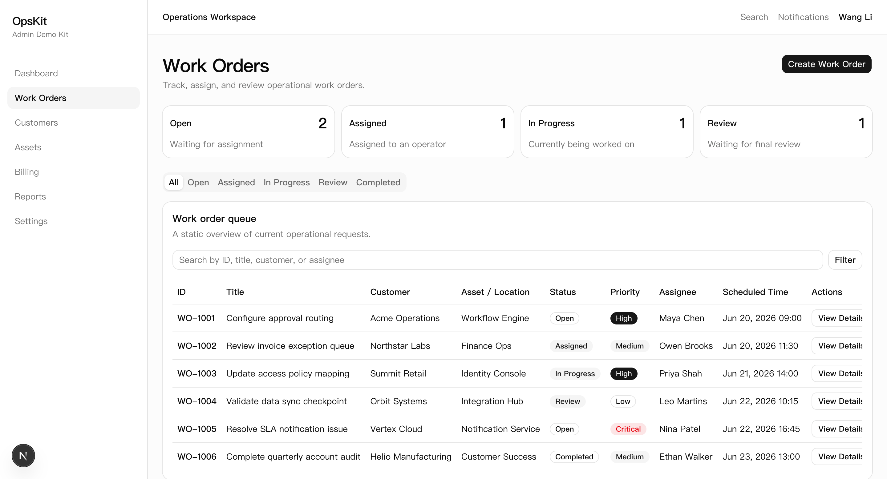
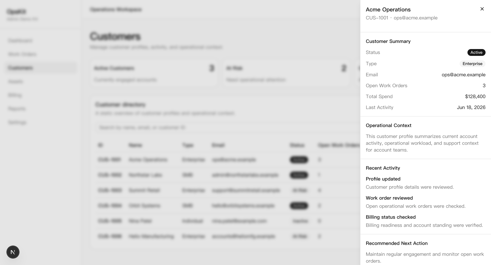
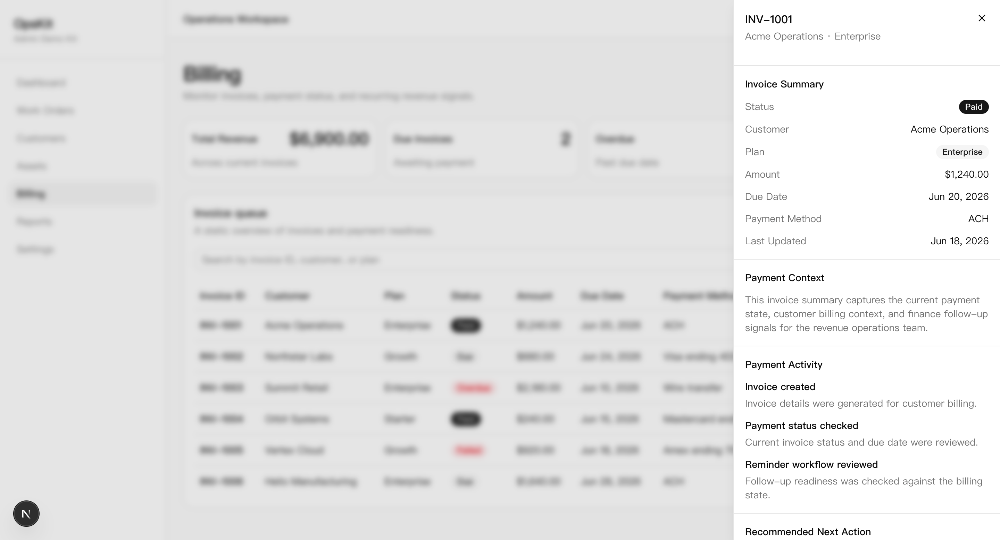
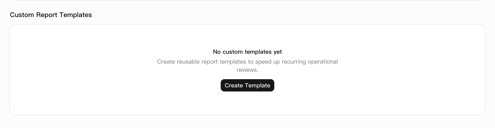
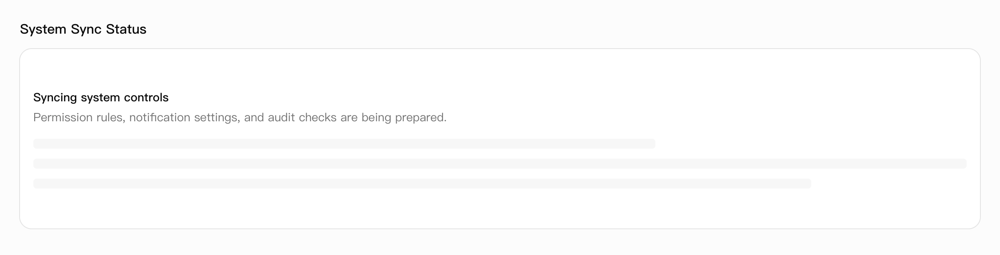
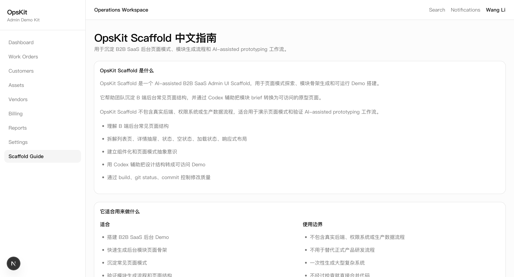
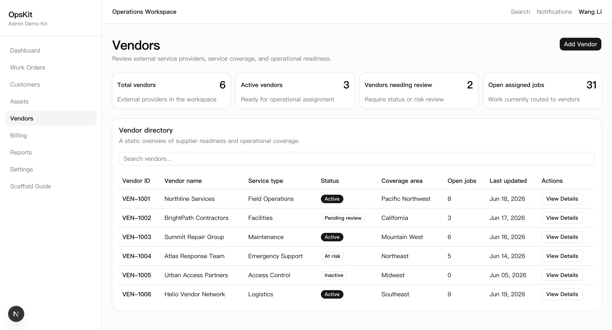

# OpsKit Admin

OpsKit Admin is a B2B SaaS Admin Demo Kit for capturing common page patterns and interaction patterns found in complex back-office systems.

It is not a real commercial admin product. It is intended for design presentation, componentization practice, and validating AI-assisted development workflows.

OpsKit Scaffold v2 extends the demo kit with reusable scaffold documentation, a Chinese scaffold guide page, a copyable Codex prompt template, and a generated Vendors demo module.

## Online Demo

- Vercel Demo: [https://opskit-admin.vercel.app/](https://opskit-admin.vercel.app/)
- EdgeOne Mirror: [https://opskit-admin-dpb5l8unsxty.edgeone.dev/](https://opskit-admin-dpb5l8unsxty.edgeone.dev/)
- Scaffold Guide: [https://opskit-admin-dpb5l8unsxty.edgeone.dev/scaffold](https://opskit-admin-dpb5l8unsxty.edgeone.dev/scaffold)
- Vendors Module: [https://opskit-admin-dpb5l8unsxty.edgeone.dev/vendors](https://opskit-admin-dpb5l8unsxty.edgeone.dev/vendors)

## Completed Modules

- Admin Shell: Sidebar + Header
- Work Orders List
- Customers List
- Assets List
- Billing List
- Reports List
- Settings
- Scaffold Guide Page
- Vendors List
- Status Summary Cards
- Search Bar
- Filter Drawer
- Work Orders Table
- Work Order Detail Drawer
- Customer Detail Drawer
- Asset Detail Drawer
- Billing Detail Drawer
- Vendor Detail Drawer
- Create Work Order Drawer
- Shared PageHeader
- Shared SummaryCardGrid
- Shared StatusBadge
- Shared DataTableCard
- Shared EmptyState component
- Shared LoadingState component
- Shared DetailSection component
- Unified detail drawer section layout
- DetailSection applied across all detail drawers
- Unified detail drawer section layout for Work Orders, Customers, Assets, and Billing
- Responsive DataTableCard
- Responsive AdminShell
- Mobile-friendly horizontal table scrolling
- Mobile navigation with Sheet menu
- Copyable Codex Prompt Template
- Empty state example in Reports module
- Loading state example in Settings module
- Vendors Mock Data
- Settings module
- Workspace Profile card
- Role & Permission Rules table
- Notification & System Rules table
- Mock Data

## Current Page Routes

- `/`: Work Orders
- `/customers`: Customers
- `/assets`: Assets
- `/billing`: Billing
- `/reports`: Reports, including a Custom Report Templates empty state example
- `/settings`: Workspace configuration, roles, notification rules, system controls, and a System Sync Status loading state example
- `/scaffold`: Chinese scaffold guide, vendor brief example, and copyable Codex prompt template
- `/vendors`: Vendors list page with summary cards, status badges, and vendor detail drawer

## Project Status

The current Demo Kit covers 7 common B2B SaaS admin modules:

- Work Orders
- Customers
- Assets
- Vendors
- Billing
- Reports
- Settings

OpsKit Scaffold v2 adds a reusable module generation workflow on top of the original demo kit. It includes documentation for component layers, page patterns, module briefs, Codex prompt templates, and a generated Vendors module used to validate the workflow.

The Vendors module is a generated demo module, not a real vendor management system.

The project has moved from page-by-page stacking into shared pattern extraction for reusable admin UI structures.

The current Demo Kit includes foundational shared list page patterns:

- PageHeader
- SummaryCardGrid
- StatusBadge
- DataTableCard

The current Demo Kit now covers the common B2B SaaS admin list + detail drawer pattern across:

- Work Orders
- Customers
- Assets
- Vendors
- Billing

AdminShell supports a foundational responsive layout:

- Desktop keeps a persistent sidebar.
- Mobile uses a top header with menu-triggered Sheet navigation.

DataTableCard supports a foundational responsive table experience:

- Desktop keeps the existing table layout.
- Mobile supports horizontal scrolling for wide tables.

The current Demo Kit covers common B2B SaaS admin state design:

- List states
- Detail drawers
- Empty states
- Loading states
- Responsive navigation and tables

DetailSection now covers 5 detail drawers:

- Work Order Detail Drawer
- Customer Detail Drawer
- Asset Detail Drawer
- Vendor Detail Drawer
- Billing Detail Drawer

## Screenshots

### Work Orders Overview

### Customer Detail Drawer

### Billing Detail Drawer

### Reports Empty State

### Settings Loading State

### Scaffold Guide

### Vendors Module

Screenshots are included to show list pages, detail drawers, empty states, loading states, scaffold documentation, and generated module examples.

## Tech Stack

- Next.js
- TypeScript
- Tailwind CSS
- shadcn/ui
- Codex

## Component Structure

- `src/components/admin-shell.tsx`: Shared application shell with desktop sidebar and mobile Sheet navigation.
- `src/components/page-header.tsx`: Shared page title, description, and action area.
- `src/components/summary-card-grid.tsx`: Shared summary card layout for module overview metrics.
- `src/components/status-badge.tsx`: Shared status badge for consistent status display across modules.
- `src/components/data-table-card.tsx`: Shared search + table card pattern with responsive horizontal scrolling.
- `src/components/empty-state.tsx`: Shared empty state component for blank or unavailable data scenarios.
- `src/components/loading-state.tsx`: Shared loading state component for async or pending data scenarios.
- `src/components/detail-section.tsx`: Shared section wrapper for detail drawers, including title, optional description, content spacing, and consistent layout.
- `src/app/scaffold/page.tsx`: Online Chinese scaffold guide page with module brief example and copyable Codex prompt template.
- `src/components/copy-prompt-block.tsx`: Small client component for displaying and copying reusable Codex prompt templates.
- `src/app/vendors/page.tsx`: Generated Vendors demo module list page.
- `src/components/vendor-detail-drawer.tsx`: Vendor detail drawer for reviewing vendor summary, operational context, recent activity, and recommended next action.
- `src/components/work-order-summary-cards.tsx`: Shows the Work Orders status summary cards.
- `src/components/work-orders-table.tsx`: Renders the Work Orders table and row action button.
- `src/components/work-order-filter-drawer.tsx`: Provides the static filter drawer for refining the work order queue.
- `src/components/work-order-detail-drawer.tsx`: Shows the selected work order details, timeline, recommendations, and available actions.
- `src/components/customer-detail-drawer.tsx`: Customer profile and activity detail drawer.
- `src/components/asset-detail-drawer.tsx`: Asset summary and maintenance context drawer.
- `src/components/billing-detail-drawer.tsx`: Invoice and payment context detail drawer.
- `src/components/create-work-order-drawer.tsx`: Provides the static create work order form drawer.
- `src/data/work-orders.ts`: Stores Work Orders mock data and related TypeScript types.
- `src/data/customers.ts`: Stores Customers mock data and related TypeScript types.
- `src/data/assets.ts`: Stores Assets mock data and related TypeScript types.
- `src/data/billing.ts`: Stores Billing mock data and related TypeScript types.
- `src/data/reports.ts`: Stores Reports mock data and related TypeScript types.
- `src/data/settings.ts`: Stores Settings mock data and related TypeScript types.
- `src/data/vendors.ts`: Stores Vendors mock data and related TypeScript types.

## Documentation Structure

- `docs/component-map.md`
- `docs/page-patterns.md`
- `docs/codex-prompts.md`
- `docs/module-generation-workflow.md`
- `docs/module-brief-template.md`
- `docs/scaffold-v2-summary.md`
- `docs/examples/vendor-module-brief.md`
- `docs/examples/vendor-generation-notes.md`
- `docs/zh/scaffold-guide.md`

These docs capture component layers, page patterns, module generation workflow, brief templates, prompt templates, and scaffold validation notes.

## Development Principles

- Make one small change at a time.
- Run `npm run build` after each change.
- Commit only after the build succeeds.
- Make the page work first, then extract components.
- Start with mock data before connecting a backend.
- Start from a module brief before generating a new module.
- Keep Codex tasks scoped and reviewable.
- Validate generated modules before committing.
- Avoid presenting generated demo modules as real production systems.

## Next Steps

- Update portfolio case study with Scaffold v2
- Capture additional drawer screenshots if needed
- Add more module brief examples
- Generate another module using the same workflow
- Explore a China-friendly deployment mirror as a side task
